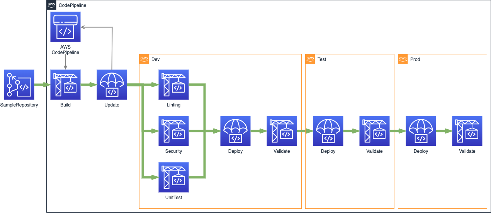

# AWS CodePipeline with CI/CD best practices

The intention of this sample is to put together [DevOps](https://aws.amazon.com/training/learn-about/devops/) CI/CD best practices and provide a sample for the [AWS CodePipeline](https://aws.amazon.com/codepipeline/).
After implementing this sample, you will get an AWS CodePipeline with linting, testing, security check, deployment and post-deployment process.
## Overview

This project is based on [AWS CDK v2](https://docs.aws.amazon.com/cdk/api/v2/docs/aws-construct-library.html) and uses TypeScript as a primary language.



The resulting pipeline deploy solution to 3 stages:
* dev - active development stage
* test - for advanced testing and integration check
* prod - production environment

In the dev stage there are 3 steps `Liniting`, `Security` and `UnitTests`. These steps runs in parallel to speedup the process.
The pipeline will stop execution on each failed step.

## Prerequsites

This project use AWS CDK v2 based on [Typescript](https://docs.aws.amazon.com/cdk/v2/guide/work-with-cdk-typescript.html). Make sure you have installed all of the following prerequisites on your development machine:

* [cfn_nag](https://github.com/stelligent/cfn_nag)
* [git-remote-codecommit](https://docs.aws.amazon.com/codecommit/latest/userguide/setting-up-git-remote-codecommit.html)
* [node](https://github.com/nvm-sh/nvm) v16.3.0
* [npm](https://github.com/nvm-sh/nvm) 7.15.1


### Installation

#### MacOS or Linux

If you are using MacOS, you can install the prerequisites by running the following command in your preferred terminal or also on Linux using [homebrew for Linux](https://docs.brew.sh/Homebrew-on-Linux):

```bash
nvm install 16.3
brew install git-remote-codecommit
brew install ruby brew-gem
brew gem install cfn-nag
```
#### AWS Cloud9

If you are using AWS [Cloud9](https://aws.amazon.com/cloud9/), you can use following command to install the prerequisites:

```bash
gem install cfn-nag
```
Note: Cloud9 should have node and npm installed. You can check the installation or version by running the following command:

```bash
node -v
npm -v
```


## Initial Deployment

For the initial deployment in your AWS account, you can run the following command:

### Cloning The GitHub Repository

```bash
git clone --depth 1 https://github.com/aws-samples/aws-codepipeline-cicd.git
```
You should remove `.git` dir from the cloned repository as [later](#set-up-remote-codecommit-repository-and-branch) we will use newly created codecommit repository as a remote origin.

```bash
cd ./aws-codepipeline-cicd
rm -rf ./.git
```

### Connect to AWS Account

It could be temporary security token or landing zone auth. Make sure you are using the correct account and region by running the following command:

```
AWS_REGION="eu-west-1"
ACCOUNT_NUMBER=$(aws sts get-caller-identity --query Account --output text)
echo "${ACCOUNT_NUMBER}"
```

### Bootstrapping an environment

```bash
npm install
npm run build
npm run cdk bootstrap "aws://${ACCOUNT_NUMBER}/${AWS_REGION}"
```


After successful bootstrap, you should see the following output:
```bash
 ⏳  Bootstrapping environment aws://{account#}/eu-west-1...
 ✅  Environment aws://{account#}/eu-west-1 bootstrapped
```

For more details refer CDK Bootstraping section in [AWS CDK](https://docs.aws.amazon.com/cdk/v2/guide/bootstrapping.html).


### Synthesize a template

To synthesize a CDK app, use the `cdk synth` command:

```
npm run cdk synth
```
You should see following output:

```
Successfully synthesized to <path-to-directory>/aws-codepipeline-cicd/cdk.out
Supply a stack id (CodePipeline, Dev-MainStack) to display its template.
```

### Deploy CodePipeline stack

Now, you can deploy the CodePipeline stack by running following command. This is required as it will create the necessary prerequisites(CodeCommit Repository) for the CodePipeline.

```
npm run cdk -- deploy CodePipeline --require-approval never
```

You should see output like following:
```bash
CodePipeline: deploying...
CodePipeline: creating CloudFormation changeset...


 ✅  CodePipeline

Outputs:
CodePipeline.RepositoryName = SampleRepository
Stack ARN:
arn:aws:cloudformation:REGION:ACCOUNT-ID:stack/CodePipeline/STACK-ID
```

### Set up remote CodeCommit Repository and branch

After successful deployment of CodePipeline stack, you should see the newly created CodeCommit repository and CodePipeline.

You can see the CodePipeline initial execution in [AWS CodePipeline console](https://eu-west-1.console.aws.amazon.com/codesuite/codepipeline/pipelines). By default when you create a repository in CodeCommit via CDK, no branch is created and thats why CodePipeline is failing to execute with below error:

`The action failed because no branch named main was found in the selected AWS CodeCommit repository SampleRepository. Make sure you are using the correct branch name, and then try again. Error: null`

You can set up remote origin as a `SampleRepository` and create required main branch by running the following command:

```
RepoName=$(aws cloudformation describe-stacks --stack-name CodePipeline --query "Stacks[0].Outputs[?OutputKey=='RepositoryName'].OutputValue" --output text)
echo "${RepoName}"

#
git init
git branch -m master main
git remote add origin codecommit://${RepoName}
git add .
git commit -m "Initial commit"
git push -u origin main
```

## CodePipeline in Action

After successful initial deployment, you should have complete CI/CD pipeline with a `main` branch of `SampleRepository` as a Source branch. As soon as you commit changes to the `main` branch the AWS CodePipeline will trigger and execute following sequence of actions:

1. Get your code from the AWS CodeCommit repository
2. Build your code
3. Update the pipeline itself (SelfMutate)
4. Execute 3 parallel jobs for `Liniting`, `Security` and `UnitTests` checks
5. In case of success the pipeline will deploy the Main stack with Infrastructure as Code example
6. Execute post-deployment check for deployed resources

## Development process via Makefile

To simplify development process and provide an ability to run tests locally we use a Makefile. The Makefile has same steps as AWS Codepipeline. A developer can execute the whole pipeline locally by command make, or execute individual step.

* Execute local pipeline: `make`
* Execute only unit testing: `make unittest`
* Deploy to the current account: `make deploy`
* Cleanup the environment: `make clean`

## Code of Conduct
This project has adopted the [Amazon Open Source Code of Conduct](https://aws.github.io/code-of-conduct).
For more information see the [Code of Conduct FAQ](https://aws.github.io/code-of-conduct-faq) or contact
opensource-codeofconduct@amazon.com with any additional questions or comments.
